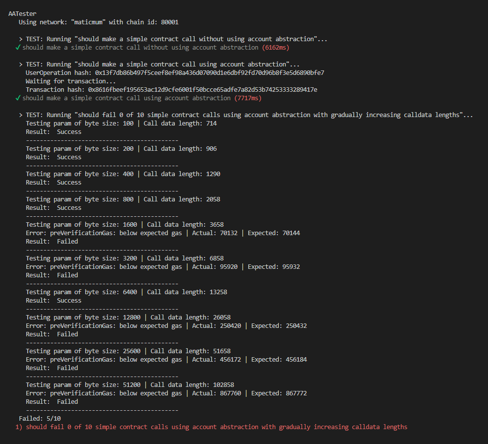

# Account Abstraction Calldata Tests

This project runs some tests using the Account Abstraction SDK, specifically to test the impact of calldata size on submitting a User Operation to a bundler.

It uses Stackup's bundler, but has also been tested with a local deployment of the Infinitism bundler, with the same results.

### Findings

- Some transactions are failing when the UserOperation is submitted to the bundler.

- Generally, the likelihood of failure increases as the calldata size increases. But in repeated tests, the results are not consistent.

- On failure, the error message is that preVerificationGas is below the expected value. It generally differs by only a small amount.

### Conclusions

It appears that the bundler is using the SDK's function for caculating preVerificationGas. Perhaps the discrepancy is related to the calculation being performed at slightly different times.

[SDK implementation of calcPreVerificationGas](https://github.com/eth-infinitism/bundler/blob/d2c3c6ba65ad4114a5efcc0756700d245ad0ce1c/packages/sdk/src/calcPreVerificationGas.ts#L61)

[Bundler implementation of calcPreVerificationGas](https://github.com/eth-infinitism/bundler/blob/264aaa35dd69d846968fc5309b5547d8876313ad/packages/bundler/src/modules/ValidationManager.ts#L6)

### Setup

Before running tests, populate the .env file (see example).

Run the tests with:

```shell
yarn hardhat test --network mumbai
yarn hardhat test --network goerli
```

### Example Output


